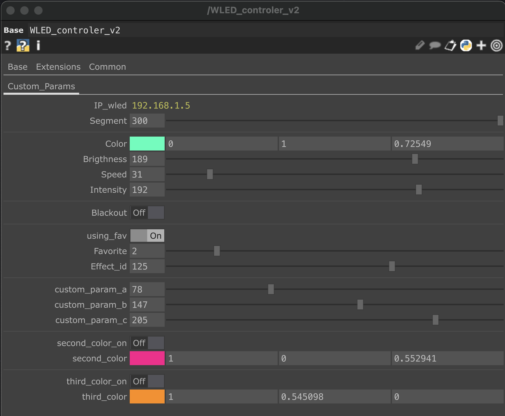

# TouchDesigner controlling WLED 

This repository provides a custom **TouchDesigner Base COMP** named `WLED_controller_v2` that allows you to control your WLED-powered LED strips directly from TouchDesigner.
Manage **colors**, **effects**, **speed**, **intensity**, and **brightness** dynamically, using optimized **UDP** and **HTTP POST** communications.
		
- Example of WLED control during a live VJ performance 
 [Yungucc & Julea](https://www.youtube.com/watch?v=c6CEpSj563g&t=2102s) 

## Getting Started

1. Open your TouchDesigner project.
2. Drop or import the `WLED_controller_v2` base component.
3. Enter the IP address of your WLED in the `IP_WLED` parameter and make sure that your computer is on the same wifi connection than the WLED.
4. Adjust other parameters to interact in real-time with your LEDs.

##  Requirements

- [WLED](https://kno.wled.ge/) (running on ESP32 or ESP8266) connected to your Wi-Fi
- [TouchDesigner](https://derivative.ca/) (tested with 2023+)
- Python module: `requests` (already included in TD or install manually)
- Local network access to WLED device
- Ensure HTTP control is enabled in WLED (enabled by default)

## PREVIEW

##  Features

-  Live color control via UDP (support for up to 3 different colors).
-  Effects, speed, intensity, brightness updated through HTTP POST.
-  Mapping of favorite effect into 8 int parameters, in order to be used in a midi controler.
-  Deadzone and rate limiting prevent unnecessary overload.
-  Fully modular and ready to integrate into your projects.
-  Fully controllable from external devices like a MIDI controller.

##  Component Overview

**Main component:**  
`WLED_controller_v2` (a Base COMP)

**Inside the Base:**

- **CHOP Parameters:** Gathers all user-defined parameters.
- **Select CHOPs:**
  - `colors_params`: Selects color-related parameters.
  - `effect_params`: Selects effect-related parameters.
- **CHOP Execute DATs:**
  - `UDP_colors`: Sends color updates via UDP, connected with the colors params operator. Everytime a parameter from the colors_params changes, an UDP request is sent to the WLED device.
  - `HTTP_POST_effects`: Sends effect updates via HTTP POST, connected with the effect params operator. Everytime a parameter from the effect_params changes, an HTTP request is sent to the WLED device.
- **UDP Out DAT:**
  - `udpout_colors`: Handles UDP packet transmission (coming from the UDP_colors).

##  Communication Methods

| Protocol    | Purpose                         | Operator Used               |
|-------------|----------------------------------|-----------------------------|
| `UDP`       | Send colors in real-time         | `UDP_colors`, `udpout_colors` |
| `HTTP POST` | Update effects, speed, intensity, brightness | `HTTP_POST_effects`         |

## Available Parameters

| Parameter   | Type        | Description |
|-------------|-------------|-------------|
| `IP_WLED`   | String      | The IP address of the WLED device (e.g., `192.168.1.5`) |
| `Segment`   | Integer     | The total number of LEDs in your strip (e.g., `300` for a 5-meter strip) |
| `Color`   | RGB         | The RGB color to send to the LED strip |
| `Brightness`| Integer (0-255) | Sets the brightness of the LED strip |
| `Speed`     | Integer (0-255) | Controls the animation speed of the effect |
| `Intensity`  | Integer (0-255) | Controls the intensity or additional parameter of the effect (fade, length, etc.) |
| `Blackout`  | Toggle      | Instantly turns off the LEDs when activated |
| `using_fav`  | Toggle      | Chose the favorite panel effects when activated, and the full panel effect when desactivated|
| `Favorite`  | Integer     | The ID of one of the 15 favorite effects chosen|
| `Effect_id`  | Integer     | The ID of every effects of WLED (https://kno.wled.ge/features/effects/) |
| `custom params_a`  | Integer (0-255) | Controls an additional parameter of the effect (fade, length, etc.) |
| `custom params_b`  | Integer (0-255) | Controls an additional parameter of the effect (fade, length, etc.) |
| `custom params_c`  | Integer (0-255) | Controls an additional parameter of the effect (fade, length, etc.) |
| `second_color_on`  | Toggle      | Send the second colors to WLED when activated |
| `second_color`   | RGB         | The RGB of the second color to send to the LED strip |
| `third_color_on`  | Toggle      | Send the second colors to WLED when activated |
| `third_olor`   | RGB         | The RGB of the second color to send to the LED strip |

##  Scripts

### UDP_colors (CHOP Execute DAT)

	• Listens for changes in the colors_params.
	• Builds a JSON structure with up to 3 colors.
	• Encodes the structure into bytes.
	• Sends the data via UDP to the WLED device.
	• Notes:
		○ Automatically handles blackout mode (turns all colors to black).
		○ Disables second and third colors if toggles are off.
#### Main actions
r1, g1, b1 = read main color
r2, g2, b2 = read second color
r3, g3, b3 = read third color
if blackout:
    set all colors to 0
if second/third color off:
    set those colors to 0
build JSON -> send via udpout_colors

### HTTP_POST_effects (CHOP Execute DAT)

	• Listens for changes in the effect_params.
	• Rate-limits requests to 1 second minimum between each POST.
	• Ignores very small value changes (threshold deadzone of 2%).
	• Sends effect changes (speed, intensity, brightness, custom params) via HTTP POST.
	• Notes:
		○ Uses favorite mapping if “Using Fav” is enabled. 
		○ Otherwise sends manually selected Effect_ID.
#### Main actions
if change bigger than threshold and after 1 sec:
    read favorite, speed, intensity, brightness
    choose mapped favorite or manual effect
    build JSON
    send HTTP POST to WLED

#### You can adapt and choose your 8 favorite effects in the script :
mapping_favorite = {1:x, 2:y,3:z,...8:za}, and replace x,y,z,... by the number of your favorite effects.

---

##  Project Structure

WLED_TD_Controller/
├── WLED_controller_v2.toe              # Main TouchDesigner file
├── Scripts/
│   ├── HTTP_POST_effects.py       # Send HTTP request to WLED device
│   ├── UDP_colors.py        # Send colors request via UDP to WLED device
│   └── midi_mapping.py      # Maps MIDI button presses to effects
├── Assets/
│   └── base_params.png            # view of every params of the component
│   ├── component_overview.png        # view of the component processes
│   └── midi_controler.png      # midi used for controling WLED
└── README.md         # Project documentation

---

## 📸 Example Use Cases

- Sync LED colors to your webcam or visual composition
- Automate light shows for a DJ set or installation
- Control WLED entirely from TouchDesigner without external UI

---

##  Future Ideas

	• Implement multi-segment support.
	• Optimize for multiple devices control in parallel.

---

##  Feedback & Contributions

Feel free to fork this project, suggest improvements, or create pull requests for better integrations or new features.

---
##  Credits

Made with ❤️ using [WLED](https://kno.wled.ge/) and [TouchDesigner](https://derivative.ca/).  
Built for creative coding, performance, and fun.
You can find me here : https://www.instagram.com/yungucc_/ 
or here : https://www.youtube.com/@julea-yungucc

---
